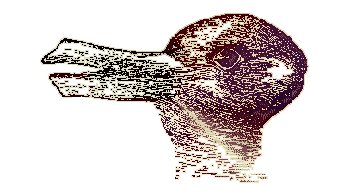

# Rabbit-duck illusion as react bulletin board
A bulletin board in react, playing with the Rabitt-duck optical illusion and Thomas Kuhn's idea of scientific paradigm shift.

For me, this is a chance to review Lynda.com's Up and Running with React tutorial with my own adjustments, following the pattern in react-notes.

Steps:

* ~~set up index and supporting files, file structure~~
* ~~generate empty background/bulletin board with basic styling~~
* ~~board react component~
* ~~check react is working as expected~~
* ~~make one note appear, note react component~~
* ~~add buttons to note (edit, save etc)~~
* ~~display hard-coded data, text & rabbit-duck image~~
* ~~make multiple notes appear from hard-coded data~~
* ~~enable note creation~~
* ~~enable editing and saving~~
* ~~enable note remove~~
* ~add randomizer to shift rotation and location of notes~~
* automatically populate many notes 
* add interactive features, guessing if it's a rabbit or a duck etc